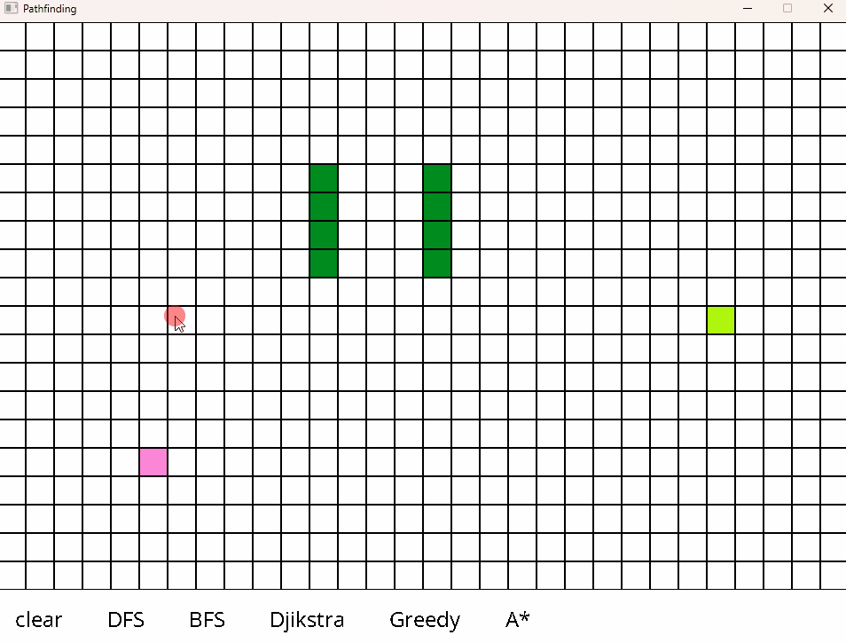
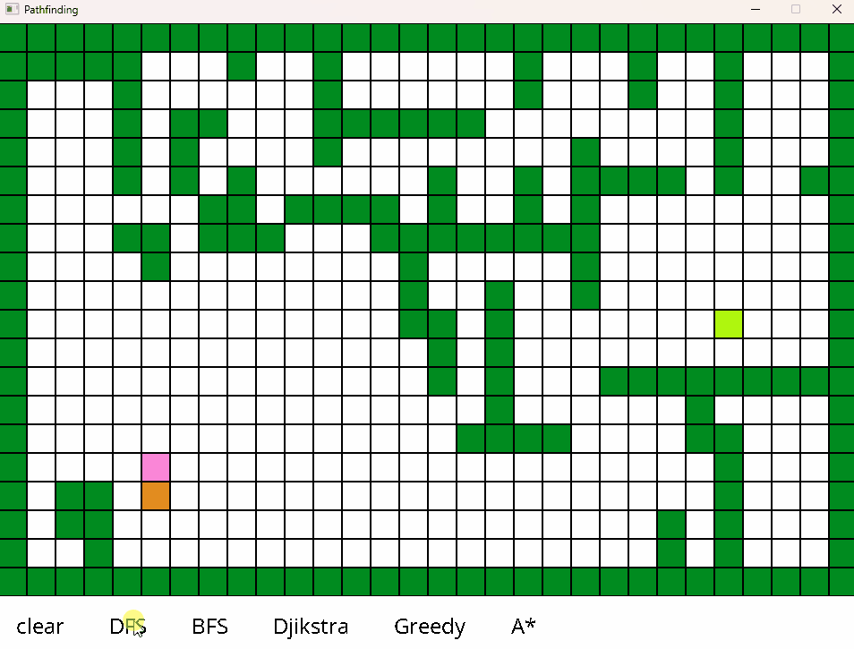
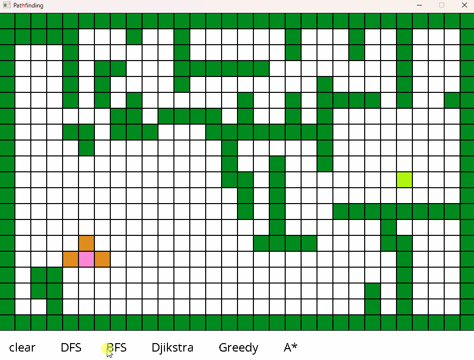
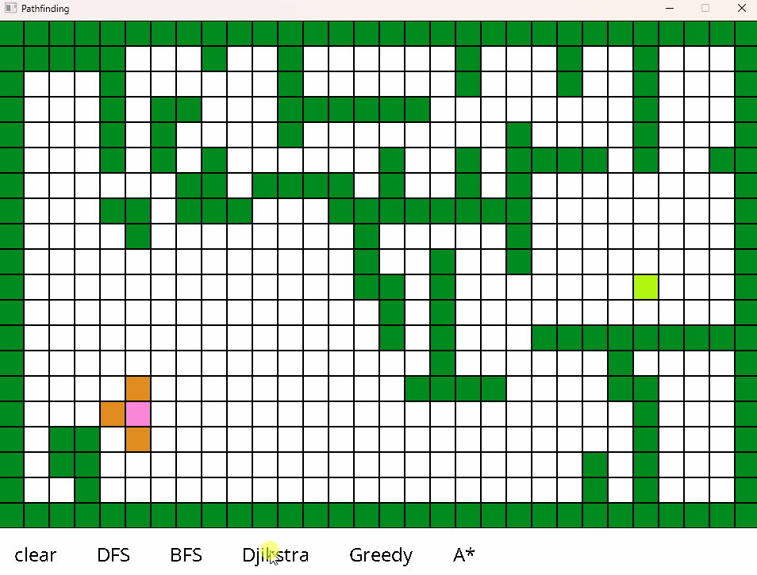
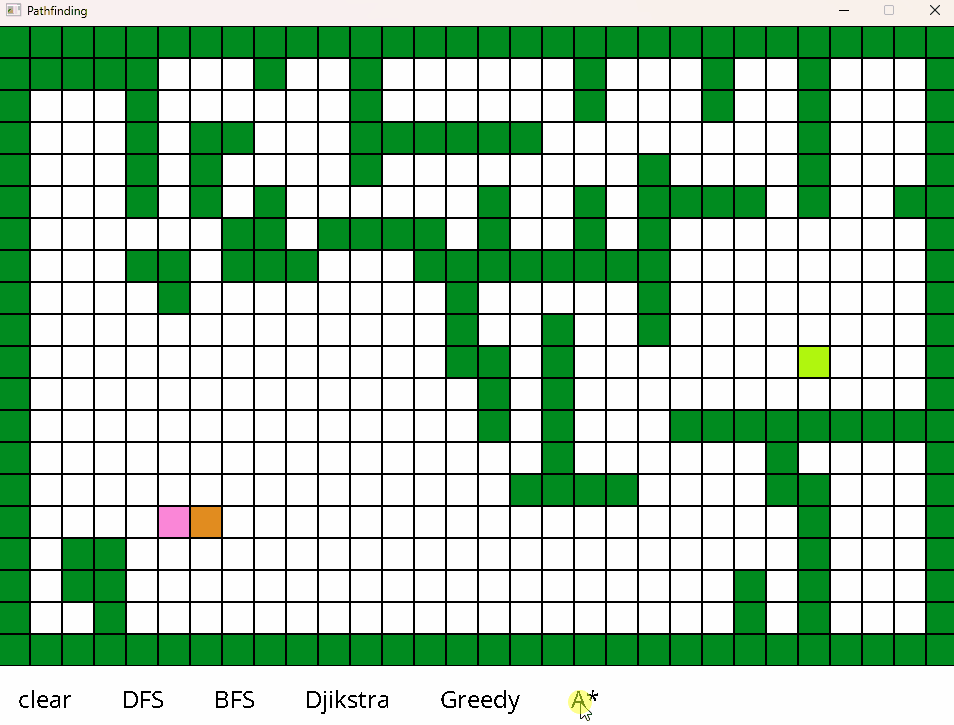

  

 

## Motivation

I had a weekend and I decided to learn different pathfinding algorithms and some SDL basics.

## Features

### Creating Obstacles
#### Creating and removing obstacles

### DFS

### BFS

### Djikstra

### Greedy

### A*

